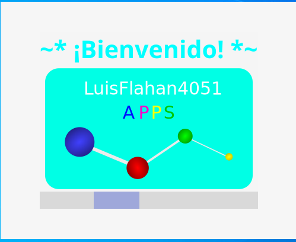
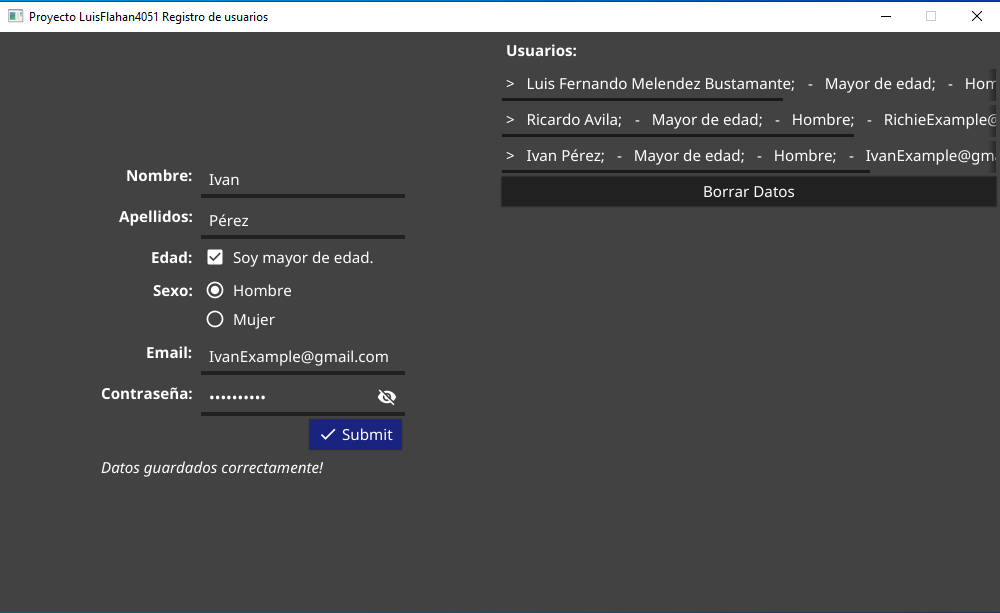
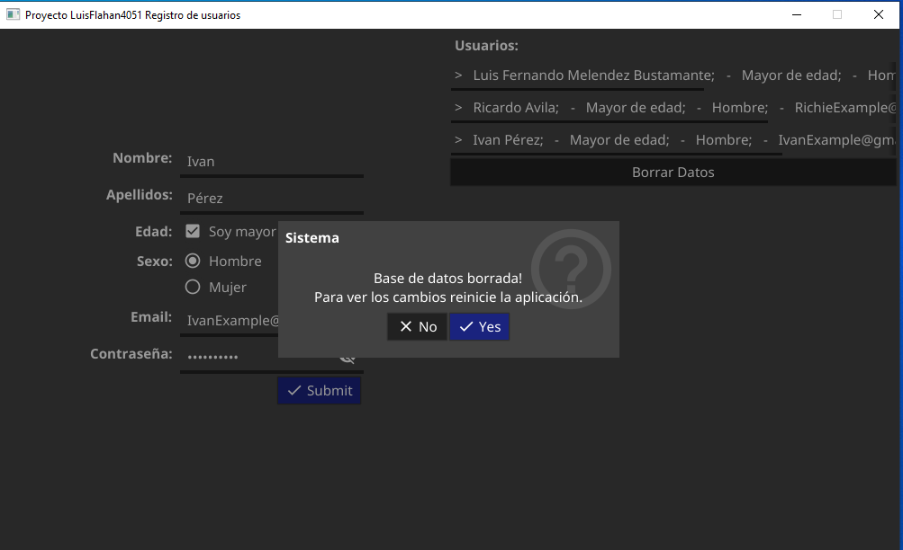
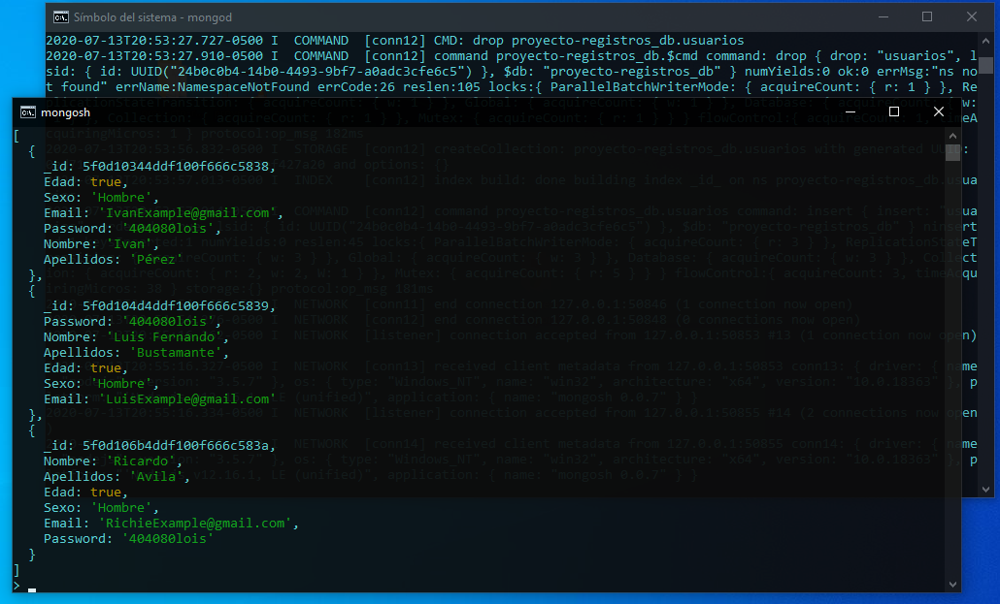

# Proyecto Simple Registradora

Proyecto escolar del instituto:
IPN - UPIICSA

Profesor: 
José Luis Goytia.

## Capturas





## Tecnologías usadas 🛠️

Lenguaje de programación **Golang**

Interfaz GUI **Fyne**

Base de Datos **MongoDB**

Controlador de versiones **Git**

### Pre-requisitos de compilación 📋

Golang

MongoDB

Librería de Fyne-Go

Driver de conexión mongodb-Go

```

```

### Instalación 🔧

**EN EDICIÓN**
**<--Para ejecutar en **windows** hay que alzar el servidor de MongoDB**
**luego abrir el archivo .exe**

**Para ejecutar en **linux** hay que alzar el servidor de MongoDB**
**luego abrir el archivo en consola con el comando**
**$ ./programa.run -->**

## Autores ✒️
Secuencia: **1CM12**

**Melendez Bustamante Luis Fernando.**
2020602568
https://github.com/luisflahan4051

**Ávila Flores Ricardo.**
2020602143.
https://github.com/RichiePeek

**Pérez Cuevas Ivan.**
2020601813.
https://github.com/Ivanpc234

## Licencia 📄

GNU GPL